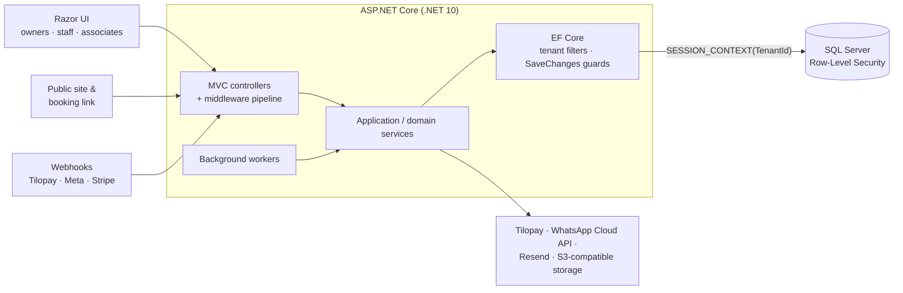

# LuxuryCloud

**A multi-tenant SaaS platform for appointment-based businesses such as beauty salons,
barbershops, nail studios and spas.** It brings scheduling, online booking, customers, staff,
payments, payroll, inventory, finances and WhatsApp customer messaging into one application.

LuxuryCloud runs in production and is used by real businesses. It is built with **ASP.NET Core MVC
(.NET 10), EF Core and SQL Server**, and tenant isolation is enforced both in the application and in
the database through **SQL Server Row-Level Security**.

> The product serves the Costa Rican market, so the UI and most domain identifiers are in Spanish
> (`Cita` = appointment, `Cobro` = charge, `Funcionario` = staff member, …). The documentation is in
> English and includes a [glossary](docs/business-domain.md#glossary).

---

## Why I built it

Small appointment-based businesses usually run on a patchwork: bookings arrive over WhatsApp,
the agenda lives in a notebook or a shared calendar, payments are written down by hand, commissions
are worked out in a spreadsheet at the end of the week, and nobody knows what the month's actual
profit was until much later.

LuxuryCloud replaces that patchwork with one system built around how these businesses actually
operate. That includes cash / card / SINPE payment splits, staff paid on commission under different
tax arrangements, walk-ins mixed with online bookings, and customers who expect a WhatsApp
confirmation the day before their appointment.

## Core capabilities

| Workflow | What the product does |
| --- | --- |
| **Appointment operations** | Staff calendar with drag-and-drop move/resize, conflict detection, breaks and recurring schedule blocks, appointment status tracking. |
| **Online booking** | Public booking page and QR code per business. Live availability comes from the same engine as the internal calendar; booking requests hold capacity until the business accepts or rejects them. |
| **Customer management** | Customer records with identity resolution by name and phone, visit history and frequency metrics, service notes. |
| **Staff operations** | Staff profiles, commission rules, tax relationship (employee / independent / chair rental), and a self-service staff portal. |
| **Payments & finance** | Charges for services and products, expenses, per-line VAT, weekly payroll settlements, a financial dashboard with a single profit formula, receipts (PDF, email, secure link). |
| **Inventory** | Products, stock levels and inventory movements tied to sales. |
| **Reporting** | Financial and analytics dashboards, Excel exports, and a monthly executive summary emailed to owners. |
| **Automated customer communication** | WhatsApp (Meta Cloud API) confirmations, reminders and cancellations, inbound replies, auto-reply and inbox, with consent tracking and message quotas. |
| **Public business presence** | A generated website per business with gallery, services, team, location and booking links, plus traffic metrics. |
| **Investors & associates** | Permission-based access for non-staff collaborators; investor profit distribution with versioned agreements, statements and payouts. |
| **Subscriptions & platform operations** | Plans by staff count (monthly/annual) with WhatsApp add-ons, recurring billing, plan changes, failed-payment recovery, and a cross-tenant operator console with billing health, reconciliation and audit log. |

## Architecture

A **modular monolith**: one ASP.NET Core MVC application organized by business module, with hosted
background workers and a single SQL Server database.



- **Controllers** are thin. Business rules live in interface-based services such as
  `ICobroService`, `IBookingAvailabilityService`, `ITaxCalculationService` and
  `IPeriodProfitCalculationService`.
- **Background workers** handle reminders, billing reconciliation, failed-payment recovery,
  subscription lifecycle, monthly reports, investor statements and platform snapshots. Each one is
  feature-flagged and runs per tenant inside an explicit tenant scope.
- **Integrations** are wrapped behind services with timeouts, retries (Polly) and idempotency.

More in [docs/architecture.md](docs/architecture.md).

## Multi-tenancy & security

All tenants share one database, so isolation is enforced by **three independent layers**:

1. **EF Core global query filters** on every tenant-owned entity, evaluated at query time against
   the current tenant.
2. **`SaveChanges` guards** that stamp `TenantId` on inserts, reject updates or deletes of another
   tenant's rows, and reject foreign keys that point to another tenant's records.
3. **SQL Server Row-Level Security**: a connection interceptor sets `SESSION_CONTEXT('TenantId')`
   when a connection opens and clears it before the connection goes back to the pool. A security
   policy applies FILTER and BLOCK predicates.

On top of that:

- **ASP.NET Core Identity** with per-request security-stamp validation (immediate revocation), an
  absolute session lifetime, lockout, and optional TOTP MFA for platform operators.
- **Role and permission-based authorization.** Associates get granular `Module.Action` permissions
  from a fail-closed custom policy provider; the permissions are read per request, not stored in
  claims.
- **Webhook authentication** (HMAC / signatures / constant-time token checks), provider-side
  payment verification, and **idempotent event processing** backed by unique constraints.
- **Rate limiting** on authentication, registration, webhooks and public booking, partitioned by
  IP and business.
- An **append-only audit log** for sensitive operations, and PII masking in logs.

More in [docs/security-and-multitenancy.md](docs/security-and-multitenancy.md).

## Selected engineering challenges

- **Tenant isolation that holds even when application code is wrong.** EF filters and write guards
  are backed by RLS in the database. The session context is applied and cleared around connection
  pooling, and migrations add RLS predicates for new tables *without switching the policy off*.
  Tests run that migration SQL against a real SQL Server.
- **Recurring billing against an imperfect provider.** Payments arrive through hosted links and
  asynchronous webhooks. Activation only happens after server-side verification with the provider.
  Duplicate events are no-ops, and amount, plan or customer mismatches go to manual review. Plan
  upgrades cancel the old provider subscription through a retrying worker, and a daily
  reconciliation job compares local state with the provider to repair known drift, alerting on
  anything it can't prove.
- **Financial consistency.** One tax engine computes VAT per line, never as `total / 1.13`, with
  half-even rounding. Charges snapshot the commission and tax configuration in force when they
  happened. One profit formula feeds the dashboard, investor statements and monthly reports, and a
  shared test suite checks that they agree.
- **Investor settlements.** Versioned agreements, contractual cut-off days (including short
  months), a `Draft → Finalized → Paid` lifecycle with serializable finalization, idempotent
  generation through filtered unique indexes, and compensating entries instead of deletions.
- **Availability as a single source of truth.** The calendar and the public booking flow share one
  availability service that combines appointments, breaks and rule-based recurring blocks. The
  rules are expanded on the fly, never materialized.
- **WhatsApp automation without spam.** Confirmations are scheduled for 24 hours before the
  appointment (or sent immediately when it's closer than that), reminders go out a set time before,
  sends are idempotent, and the whole feature is gated per tenant by add-on, consent and quota.
- **Business-time correctness.** Scheduling, reporting and period boundaries all use the business's
  local time zone through one provider rather than server UTC.

## Technology

| Layer | Stack |
| --- | --- |
| Runtime | .NET 10, C# (nullable enabled) |
| Web | ASP.NET Core MVC, Razor views, Bootstrap 5, vanilla JavaScript |
| Data | Entity Framework Core 10, SQL Server (Row-Level Security, filtered unique indexes), 65 migrations |
| Identity | ASP.NET Core Identity, cookie auth, Data Protection, TOTP |
| Integrations | Tilopay (recurring payments), Stripe (webhooks), Meta WhatsApp Cloud API, Resend (email), S3-compatible storage (Cloudflare R2), Cloudflare Turnstile |
| Libraries | Polly, QuestPDF, ClosedXML, QRCoder, SixLabors.ImageSharp, MailKit, AWS SDK / Minio |
| Testing | xUnit, EF Core SQLite in-memory, ASP.NET Core TestHost, SQL Server integration tests |
| Hosting | Linux, Nginx reverse proxy, systemd |

## Repository structure

```
LuxuryCloud/
├── LuxuryApp.slnx                 # Solution (app + tests)
├── docs/                          # Architecture, domain, security, local setup
├── database/                      # Schema-only SQL Server baseline for local development
├── .github/workflows/ci.yml       # Build, vulnerability check, tests, SQL Server RLS tests
└── LuxuryApp/                     # ASP.NET Core application
    ├── Program.cs                 # Composition root: DI, auth, rate limits, pipeline
    ├── Controllers/<Module>/      # Thin MVC controllers per business module
    ├── Services/<Module>/         # Application & domain services (interfaces + implementations)
    ├── Models/<Module>/           # EF entities and view models
    ├── Datos/                     # ApplicationDbContext (tenant filters & guards), seeding
    ├── Migrations/                # EF Core migrations (incl. RLS and backfill SQL)
    ├── Workers/                   # Hosted background services
    ├── Middleware/, Filters/      # Subscription gate, contract acceptance, MFA enrollment
    ├── Views/, wwwroot/           # Razor views, CSS, JavaScript
    └── LuxuryApp.Tests/           # xUnit test suite
```

## Running locally

**Build and test** (needs only the .NET 10 SDK):

```bash
git clone <this-repo> && cd LuxuryCloud
dotnet build LuxuryApp.slnx -c Release
dotnet test LuxuryApp.slnx -c Release --filter "Category!=SqlServer"
```

**Run the web app** (also needs SQL Server and `sqlcmd`). The migration history starts from a
schema that predates EF migrations, so an empty database is created from the schema-only baseline
in [`database/`](database/README.md) instead:

```bash
sqlcmd -S localhost -E -C -Q "CREATE DATABASE [LuxuryCloud_Dev] COLLATE Modern_Spanish_CI_AS"
sqlcmd -S localhost -E -C -I -f 65001 -d LuxuryCloud_Dev -i database/LuxuryCloud.Schema.sql
sqlcmd -S localhost -E -C -I -f 65001 -d LuxuryCloud_Dev -i database/LuxuryCloud.ReferenceData.sql

# Local configuration (git-ignored): connection string and base URL
cp LuxuryApp/appsettings.Development.example.json LuxuryApp/appsettings.Development.json
dotnet run --project LuxuryApp/LuxuryApp.csproj --launch-profile https
```

Then register a business at `https://localhost:7239/Accounts/Registro`. Local sign-ups need one
activation step because no email is sent; see [database/README.md](database/README.md#steps).

No credentials are required, and none are included. The committed configuration is inert: every
integration and side-effecting background worker is disabled until configured. Details:
**[docs/local-development.md](docs/local-development.md)**.

## Testing

About **2,300 automated tests** (xUnit) cover the tax engine, payroll and profit calculations,
investor statements, booking and availability, billing and webhook processing, reconciliation,
tenant isolation, and the HTTP security pipeline (cookies, antiforgery, rate limits via
`TestHost`).

```bash
# No database server needed (SQLite in-memory)
dotnet test LuxuryApp.slnx --filter "Category!=SqlServer"

# Full suite, including the RLS tests against SQL Server (local Windows auth by default,
# or any test server via LUXURYCLOUD_TEST_SQLSERVER)
dotnet test LuxuryApp.slnx
```

CI (GitHub Actions) builds the solution, fails on known-vulnerable NuGet packages, runs the main
suite, and runs the SQL Server category in a separate job against an ephemeral SQL Server container.

## Production engineering

LuxuryCloud is deployed as a production service on Linux behind an Nginx reverse proxy, running as
a systemd service against SQL Server. The code reflects this:

- forwarded-header handling, HSTS and security headers, and a persistent Data Protection key ring
  so sessions survive redeploys;
- feature-flagged background workers with heartbeats, shown in an internal operations console
  ("Mission Control") alongside queue depths and billing health;
- idempotent webhook processing, provider reconciliation and payment-recovery flows that ship in
  dry-run mode and are switched on deliberately;
- migrations written to run against a live multi-tenant database: conservative data backfills,
  and new tables registered with RLS without disabling the policy;
- environment-specific configuration supplied outside the repository, with no secrets in source control.

<!--
## Screenshots

| | |
| --- | --- |
|  |  |
|  |  |

Demo video: <link>
-->

## Engineering notes

This is a real business application that has grown with its users. Requirements came from
operating businesses, and some module names and older migrations reflect that history. Throughout,
the design favors explicit single sources of truth (one tax engine, one profit formula, one
availability service, one account-provisioning service), correctness in the database over trust in
application code, and features that ship disabled behind configuration and are turned on
deliberately in production.

The repository is published as a portfolio. Deployment scripts, production configuration and
operational runbooks are intentionally not included. LuxuryCloud is a commercial product: the source
is shared for review, and no open-source license is granted.
