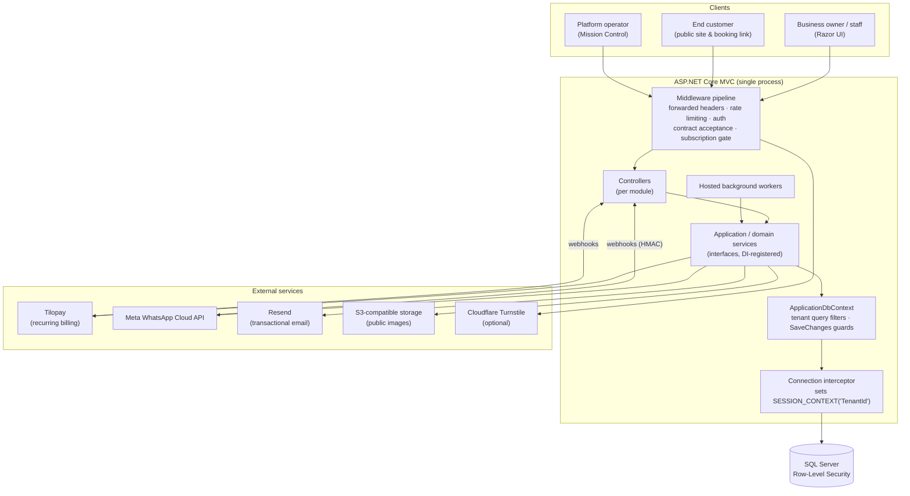

# Architecture

LuxuryCloud is a **modular monolith**: a single ASP.NET Core MVC application (.NET 10) backed by one
SQL Server database, with background workers hosted in the same process. Modules are separated by
folder and by service interfaces rather than by deployable units. That keeps a one-person
operation simple to deploy and reason about, while the service boundaries stay explicit enough to
test in isolation.

> Most domain identifiers are in Spanish because the product targets businesses in Costa Rica. A
> glossary is in [business-domain.md](business-domain.md#glossary).

## High-level view

## Code organization

| Path | Responsibility |
| --- | --- |
| `LuxuryApp/Program.cs` | Composition root: DI registrations, auth/authorization policies, rate-limit policies, middleware order, options binding and validation. |
| `LuxuryApp/Controllers/<Module>` | Thin MVC controllers. Business rules live in services; controllers handle HTTP concerns, authorization attributes and view models. |
| `LuxuryApp/Services/<Module>` | Application and domain services behind interfaces (`ICobroService`, `IBookingAvailabilityService`, `ITaxCalculationService`, …). |
| `LuxuryApp/Models/<Module>` | EF Core entities, enums and view models. Tenant-owned entities implement `ITenantEntity`. |
| `LuxuryApp/Datos/ApplicationDbContext.cs` | EF Core model, global tenant filters and `SaveChanges` tenant guards. |
| `LuxuryApp/Migrations` | EF Core migrations, including hand-written SQL for data backfills and RLS predicates. |
| `LuxuryApp/Workers` | `BackgroundService` implementations (billing reconciliation, reminders, reports, …). |
| `LuxuryApp/Middleware`, `LuxuryApp/Filters` | Cross-cutting request pipeline concerns (subscription gate, contract acceptance, MFA enrollment, client-disconnect handling). |
| `LuxuryApp/Views`, `LuxuryApp/wwwroot` | Razor views, per-module CSS and vanilla JavaScript (Bootstrap 5). |
| `LuxuryApp/LuxuryApp.Tests` | xUnit test suite (see [local-development.md](local-development.md#tests)). |

## Request pipeline

Order matters and is set explicitly in `Program.cs`:

1. **Client-disconnect middleware** turns aborted requests into a silent 499 instead of a logged 500.
2. **Forwarded headers**, for hosting behind an Nginx reverse proxy on Linux.
3. **HTTPS redirection, static files, request localization** (single culture: `es-CR`).
4. **Rate limiting** with named fixed-window policies for registration, login, password reset,
   webhooks and the public booking endpoints. Booking policies are partitioned by
   *IP + business slug*, so traffic against one tenant can't use up another tenant's quota.
5. **Authentication** (ASP.NET Core Identity cookie).
6. **Contract acceptance middleware**: users must accept the current, hash-versioned terms.
7. **Subscription middleware**: tenants without commercial access are redirected to billing.
8. **Authorization**. A global `AuthorizeFilter` requires an authenticated user by default, so
   public endpoints must opt out explicitly.

## Data access

- **EF Core 10 + SQL Server.** Queries use projections (`Select`) and batch loading in the heavier
  dashboards. Several migrations (`optimize*Module`) exist only to add composite indexes led by
  `TenantId` for the hot query paths.
- **Tenant isolation is enforced in three layers:** EF global query filters, `SaveChanges` guards,
  and SQL Server Row-Level Security. See [security-and-multitenancy.md](security-and-multitenancy.md).
- **Business time.** All "today"/"this month" logic goes through `IBusinessDateTimeProvider`
  (configured time zone, default `America/Costa_Rica`) rather than server UTC. Appointment times are
  stored as business-local time, and audit/billing timestamps as UTC.
- **Money.** Monetary columns are `decimal(18,2)`. Tax and commission rounding is centralized in
  one engine (half-even, 2 decimals). See [business-domain.md](business-domain.md#financial-engine).

## Background processing

Workers are `BackgroundService`s in the web process. Each one resolves scoped services per run and
is **feature-flagged through configuration**, so it can ship disabled and be turned on in production
deliberately.

| Worker | Purpose |
| --- | --- |
| `ReminderWorker` | WhatsApp confirmation/reminder scheduling and dispatch of pending notifications. |
| `BillingReconciliationWorker` | Daily safety net: compares local subscriptions and payments with the provider, repairs known drift, raises alerts. |
| `PaymentRecoveryWorker` | Failed-payment lifecycle: grace period, notifications, optional suspension (dry-run by default). |
| `PlanChangeCancellationRetryWorker` | Retries cancelling the previous provider subscription after an upgrade, to prevent double recurring charges. |
| `SubscriptionLifecycleWorker` | Closes subscriptions whose cancel-at-period-end date has passed. |
| `PendingTenantExpirationWorker` | Soft-expires unverified sign-ups (anti-abuse; off by default). |
| `MonthlyReportSchedulerService` | Sends each tenant's monthly executive summary email. |
| `InvestorStatementGenerationWorker` | Closes investor statement periods automatically when enabled. |
| `CommercialSnapshotWorker` | Captures a monthly platform snapshot (MRR, churn, trials) that can't be reconstructed later. |
| `VisitasBackgroundService` | Processes finished appointments and records customer visits, tenant by tenant. |

Multi-tenant workers iterate through `TenantExecutionService.RunForEachActiveTenantAsync`, which runs
each tenant in its own DI scope with that tenant as the ambient context. The EF filters, the
`SaveChanges` guards and the SQL Server session context therefore apply inside background jobs
exactly as they do inside HTTP requests.

Workers publish heartbeats (`IWorkerHeartbeatService`) that the platform console ("Mission
Control") shows next to queue depths and billing health.

## External integrations

| Integration | How it is used | Safety measures |
| --- | --- | --- |
| **Tilopay** (payment gateway) | Hosted recurring-payment links, webhooks, and an admin API for subscriber lookup and cancellation. | Webhook access-token check (constant-time comparison), payment verification against the provider before activation, idempotent event store, amount/plan/email mismatch → manual review, daily reconciliation. |
| **Stripe** | Alternative provider webhook endpoint. | Signature verification via `EventUtility.ConstructEvent`, persisted and de-duplicated events. |
| **Meta WhatsApp Cloud API** | Template messages for appointment confirmations, reminders and cancellations; inbound replies and auto-replies. | `X-Hub-Signature-256` HMAC verification, per-tenant opt-in and customer consent, monthly/daily quotas per add-on plan. |
| **Resend** | Transactional email (account, invitations, receipts, reports, payment recovery). | Idempotency keys per business event (e.g. one recovery email per incident stage). |
| **S3-compatible object storage** (Cloudflare R2) | Public website images, with a local-disk provider for development. | Size/type limits, server-side re-encoding to WebP (ImageSharp), per-tenant quotas. |
| **Cloudflare Turnstile** | Optional bot challenge on registration. | Disabled unless configured. |

HTTP clients are registered through `IHttpClientFactory` with explicit timeouts. Transient-failure
retries for the payment provider use Polly.

## Supporting libraries

QuestPDF (receipts and investor statements), ClosedXML (Excel exports), QRCoder (booking-link QR
codes), SixLabors.ImageSharp (image processing), MailKit (SMTP), AWS SDK / Minio (S3-compatible
storage).

## Deployment model

The application runs on Linux behind Nginx, managed by systemd. The code reflects this through
forwarded-header handling, a stable Data Protection key path (auth cookies survive restarts and
redeploys), HSTS and security headers outside Development, and an absolute public base URL used for
links generated outside a request (emails, background jobs). Infrastructure-specific values are
supplied through environment variables and are not part of this repository.
